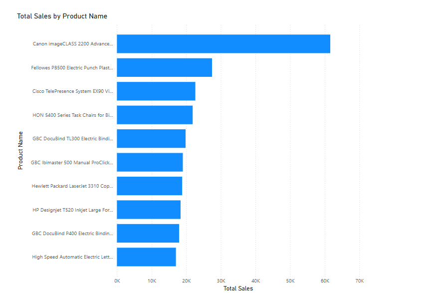

# 📊 Superstore Sales Dashboard – Power BI

## 🚀 Internship Project – Task 1  
**Future Interns – Data Science & Analytics Internship**  
Created by: **Priyansh Golwalkar**

---

## 🧾 About the Project

This Power BI dashboard analyzes Superstore sales data to identify:
- 📦 Best-selling products
- 📍 Top-performing regions
- 🕒 Monthly sales trends
- 💸 Category-wise revenue insights

The goal is to provide business owners and decision-makers with clear visual insights for driving better strategies and understanding performance across product lines and markets.

---

## 🛠 Tools & Skills Used

- **Power BI Desktop** – For data modeling and dashboard design  
- **Microsoft Excel** – For initial data cleaning  
- **Data Cleaning** – Removing nulls, formatting date fields  
- **DAX** – Created KPIs like Total Sales, Quantity Sold, Profit  
- **Charts** – Line, bar, column, and card visuals with slicers

---

## 📈 Dashboard Highlights

- 📌 **KPI Cards**: Total Sales, Quantity Sold, Total Profit  
- 📊 **Line Chart**: Monthly Sales Trends  
- 📂 **Bar Charts**: Category and Sub-Category-wise Sales  
- 🌍 **Map View**: Regional performance by State  
- 🧭 **Interactive Filters**: Region, Category, Segment

---

## 📎 Dataset Source

Sample Superstore Sales dataset (public & beginner-friendly).  
Contains order details like:
- Product names
- Sales, profit, quantity
- Customer segment
- Region & city
- Dates and discounts

---

## ✅ Insights & Recommendations

🔹 **Office Supplies** was the highest-selling category, but with lower profit margins.  
🔹 **West and East** regions brought the most revenue consistently.  
🔹 **December** showed a sales peak — indicating end-of-year demand.  
🔹 Recommendation: Boost sales in low-profit but high-demand sub-categories with better pricing or bundled offers.

---

## 📷 Screenshot

---

## 🔗 Submission Details

> ✅ Internship Program: **Future Interns – Task 1**  
> 📅 Duration: June 2025  
> 👨‍💻 Platform: Power BI Desktop

---

## 📬 Contact

Made with ❤️ by **Priyansh Golwalkar**  
